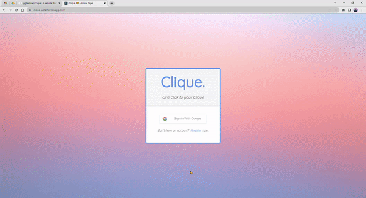
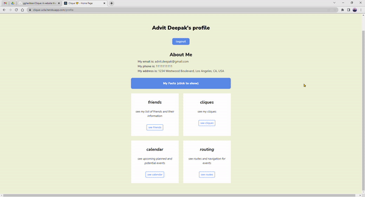
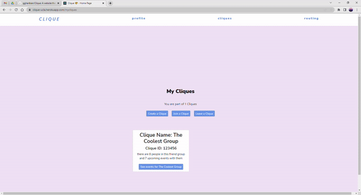
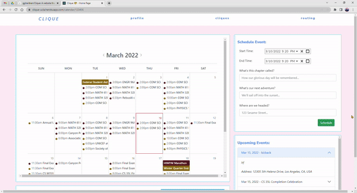

# Clique

Clique is an application meant to enhance the experience of social circles.

Its current implementation contains the following features:

* Profile - Create a profile and add/modify address, driving preferences, and availability
* Friends & Cliques - Add/remove friends and create/join/leave a Clique (friend group)
* Routing - Multiple addresses, driving/time constraints, indicate who a user will pick up or be picked up by, etc.
* Calendar - Automatic import from Google Calendar, priority lists, etc.

Clique leverages technology to resolve the issues that many groups face,
especially in terms of planning where and when to meet.

## Features + Functions

Login and Registration Page: 

Friends and Cliques Page: 

Calendar and Scheduling Page: 

Maps and Routing Page: 

&nbsp;&nbsp;

## Running the Program

Please ensure that location services are turned on and that you allow the local host that opens when you run `npm start` after the following directions to access your location.

First, clone this repository with the following command:

`git clone https://github.com/ggharibian/Clique`

`cd Clique` where Clique is the folder git cloned into

From here, we can run:

`npm install`

`npm start`

Runs the app in the development mode.\
Now, open [http://localhost:3000](http://localhost:3000), or whichever local host `npm start` directs you to, to view it in your browser.

&nbsp;&nbsp;

## Further Resources

[Project Proposal](https://docs.google.com/document/d/1K-f6SdqdyJ3yzxbiAFyreZ2cZy3pWdi0vsIUpSTLwv8/edit?usp=sharing)

[Project Slides](https://docs.google.com/presentation/d/1ZA4glt8DjXkK76I6f4x71AkWuDspXHnTVAT1rjyctOA/edit?usp=sharing)

&nbsp;&nbsp;

## Sources (tools)

This project was bootstrapped with [Create React App](https://github.com/facebook/create-react-app).

&nbsp;&nbsp;

## Bibliography

“Alerts.” React-Bootstrap, https://react-bootstrap.github.io/components/alerts/#dismissing.

Aliustaoglu, Cuneyt. “Using Google Maps in React without Custom Libraries.” Full Stack Developer &amp; Amateur Musician, Full Stack Developer &amp; Amateur Musician, 27 Oct. 2018, https://cuneyt.aliustaoglu.biz/en/using-google-maps-in-react-without-custom-libraries/. 

“Calendar API &nbsp;|&nbsp; Google Developers.” Google, Google, https://developers.google.com/calendar/api. 

Ed. “Responsive Navigation Bar Tutorial | HTML CSS JAVASCRIPT.” Youtube, 29 Aug. 2018, https://www.youtube.com/watch?v=gXkqy0b4M5g. 

“Google Maps API.” Google Maps Platform &nbsp;|&nbsp; Google Developers, Google, https://developers.google.com/maps. 

“How To Create a Sticky Navbar.” W3Schools, https://www.w3schools.com/howto/howto_js_navbar_sticky.asp. 

Raj, Shanjai. “Build a Contact Form Using React and Firebase - YouTube.” YouTube, 3 Aug. 2020, https://www.youtube.com/watch?v=RKj3OjgftXc. 

Raj, Shanjai. “React-Contact-Form/Contact.js at Master · Shanjairaj7/React-Contact-Form.” GitHub, 3 Aug. 2020, https://github.com/shanjairaj7/React-contact-form/blob/master/src/components/Contact.js. 

Thornton, Jacob, and Mark Otto. “Forms.” Bootstrap, https://getbootstrap.com/docs/4.0/components/forms/#readonly-plain-text. 

&nbsp;&nbsp;
