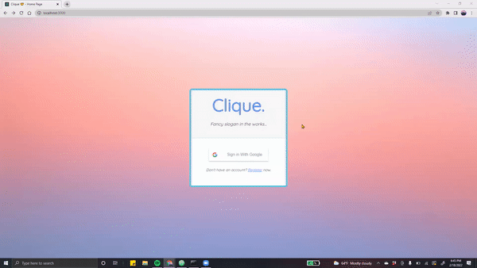

# Clique - CS 35L Winter '22

Clique is an application meant to enhance the experience of social circles.
It's current implementation contains the following features:

* Routing - Multiple addresses, driving/time constraints, etc.
* Calendar - Automatic import from Google Calendar, priority lists, etc.
* Favorites - Group's most visited locations, most favorite foods, name, etc.

Clique leverages technology to resolve the issues that many groups face,
especially in terms of planning where and when to meet.

## Features + Functions

> TODO: INSERT SCREENSHOTS HERE

&nbsp;&nbsp;

## Running the Program

First, clone this repository with the following command:

`git clone https://github.com/ggharibian/Clique`

Then, `cd` into the frontend in order to start it up:

`cd frontend`

From here, we can run:

`npm install`
`npm install firebase react-router-dom react-firebase-hooks`
`npm install react-time-range`
`npm install --save react react-dom @emotion/react`
`npm install --save --legacy-peer-deps @ericz1803/react-google-calendar`

`npm start`

Runs the app in the development mode.\
Now, open [http://localhost:3000](http://localhost:3000) to view it in your browser.

> TODO: FIGURE OUT HOW BACKEND WILL LOOK LIKE!

&nbsp;&nbsp;

## Further Resources

> TODO: ADD LINKS TO GOOGLE DOCS, PRES SLIDES, ETC.

&nbsp;&nbsp;

## Sources (tools)

This project was bootstrapped with [Create React App](https://github.com/facebook/create-react-app).

> TODO: ADD OTHER TECH STACKS WE'RE GONNA USE

&nbsp;&nbsp;
